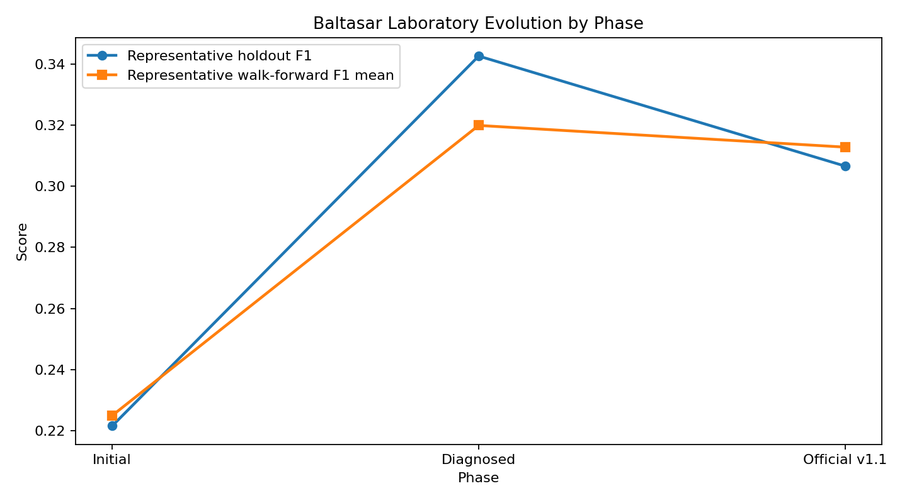
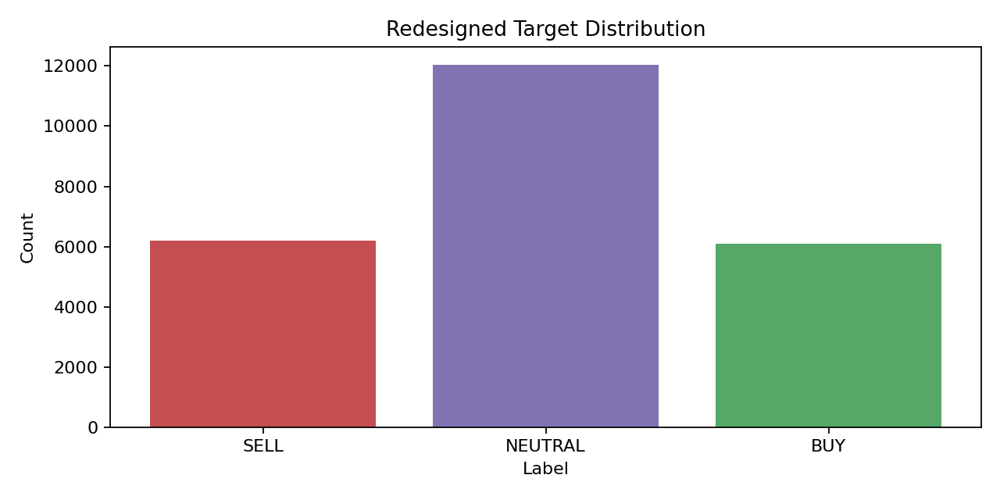
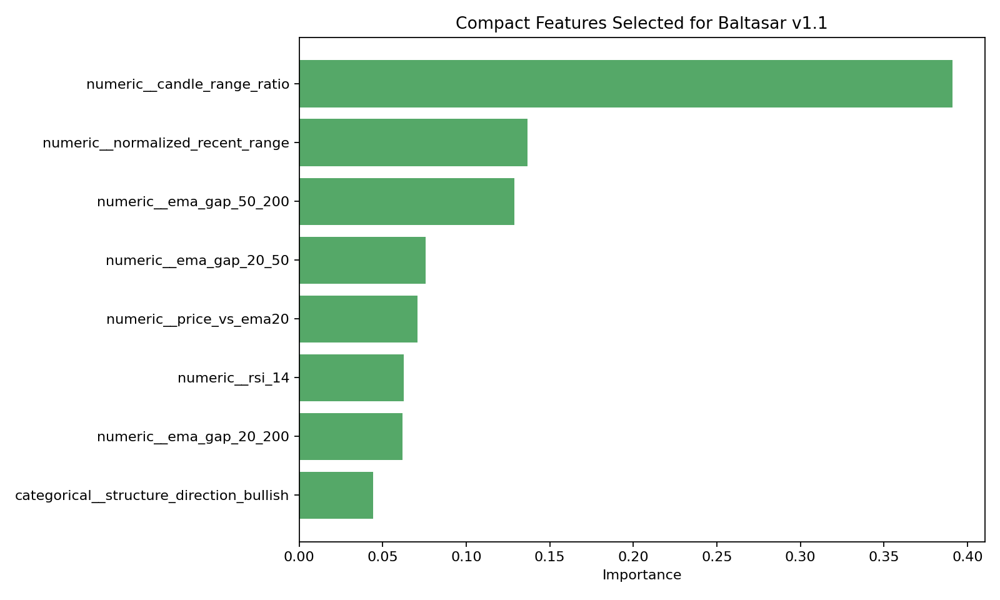
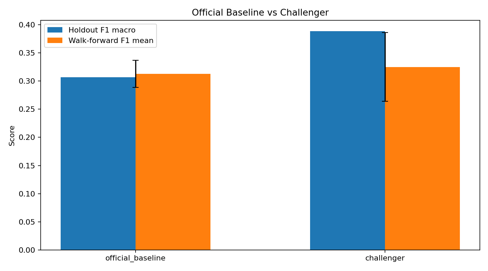
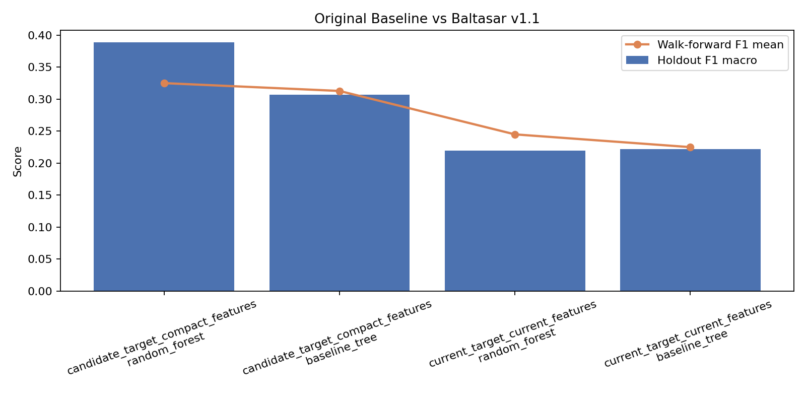
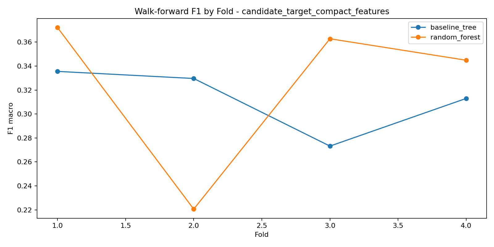
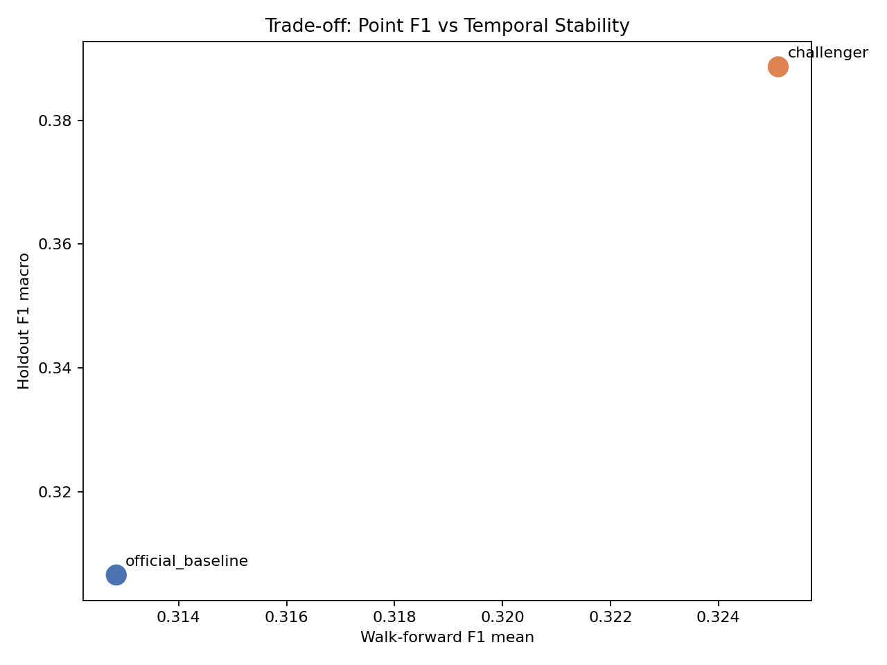

# Baltasar v1.1 Executive Report

## Executive Summary

Baltasar v1.1 ya esta consolidado como baseline oficial del laboratorio de clasificacion de direccion de mercado dentro de MAGI. La configuracion oficial usa target `h18_t05`, features `compact`, `baseline_tree` como baseline y `random_forest` como challenger.

La recomendacion ejecutiva es adoptar Baltasar v1.1 como referencia operativa de laboratorio para Prosperity, porque mejora de forma material la estabilidad y la trazabilidad respecto a la version inicial, aun cuando no maximiza la mejor metrica puntual observada.

## Que construyo Codex

- un laboratorio reproducible de entrenamiento, diagnostico y consolidacion para Baltasar
- validacion de dataset, dashboards, notebooks y artefactos exportables
- una ruta de decision por fases: corrida inicial, diagnostico, rediseno y consolidacion oficial
- una base oficial v1.1 y un challenger documentado

## Cual era el problema inicial

El laboratorio arranco con una version honesta pero debil:

- target muy dominado por `NEUTRAL`
- bajo `F1 macro`
- alta sensibilidad al horizonte y threshold del target
- inestabilidad real entre tramos temporales
- redundancia alta en snapshots de precio

## Que se diagnostico

La conclusion del diagnostico fue clara:

- el problema principal no era solo el modelo; era la definicion del target y la estructura del set de features
- el target original `h12_t08` estaba demasiado cargado hacia `NEUTRAL`
- varias features aportaban poco o duplicaban informacion
- la estabilidad temporal debia pesar mas que una sola corrida holdout

## Como cambio el target

Se rediseno el target oficial a `h18_t05`:

- horizonte futuro: `18`
- threshold: `0.0005`

Esto mejoro el balance de clases y la calidad de senal para entrenamiento. La distribucion objetivo redisenada queda aproximadamente:

- {'SELL': 6193, 'NEUTRAL': 12038, 'BUY': 6096}

## Como se simplificaron las features

Se reemplazo un set cargado de snapshots absolutos por una variante `compact` basada en relaciones mas explicativas:

- rangos normalizados
- gaps entre EMAs
- precio relativo frente a EMAs
- RSI
- direccion estructural

Features compactas mas relevantes:

- numeric__candle_range_ratio, numeric__normalized_recent_range, numeric__ema_gap_50_200, numeric__ema_gap_20_50, numeric__price_vs_ema20, numeric__rsi_14, numeric__ema_gap_20_200, categorical__structure_direction_bullish

## Por que `baseline_tree` quedo como baseline oficial

`baseline_tree` no fue el mejor modelo puntual, pero si el mejor baseline para gobernanza del laboratorio:

- holdout `F1 macro`: 0.3066
- walk-forward `F1 mean`: 0.3128
- walk-forward `F1 std`: 0.0243
- numero de features: 16

La dispersion temporal fue claramente menor que la del challenger. Para Prosperity, esto significa una base mas interpretable, mas estable y mas facil de monitorear.

## Por que `random_forest` quedo como challenger

`random_forest` compacto quedo documentado como challenger porque:

- logra mejor `F1 macro` puntual: 0.3886
- logra mejor `walk-forward F1 mean`: 0.3251
- pero su variabilidad temporal es bastante mayor: 0.0611

En terminos ejecutivos: hoy parece mas fuerte en una foto, pero menos confiable como referencia oficial del laboratorio.

## Que metricas importan

Para esta etapa importan principalmente:

- `F1 macro`: porque evita premiar solo la clase dominante
- `accuracy`: como referencia general, pero no como criterio principal
- metricas por clase: para entender si el sistema realmente distingue `BUY`, `SELL` y `NEUTRAL`
- `walk_forward_f1_mean`: porque mide robustez entre tramos temporales
- `walk_forward_f1_std`: porque mide estabilidad

## Que significa el trade-off entre F1 puntual y estabilidad temporal

El laboratorio eligio una configuracion que no persigue solo el mejor numero puntual, sino la mejor combinacion entre rendimiento, estabilidad y explicabilidad.

Eso significa aceptar un `F1` puntual menor si a cambio obtenemos:

- menor dispersion entre tramos
- mayor trazabilidad del comportamiento
- mejor capacidad de explicar por que el baseline fue elegido

## Que puede hacer Baltasar hoy

- clasificar direccion de mercado en tres clases con una base reproducible y monitoreable
- servir como baseline serio para comparaciones futuras
- mostrar una estructura clara de gobierno entre baseline oficial y challenger
- sostener una narrativa tecnica defendible frente a decisiones futuras

## Que no puede hacer todavia

- no esta listo para produccion operativa sin mas fases
- no garantiza robustez suficiente para todos los regimenes de mercado
- no incorpora calibracion, costos de clase ni tuning fino
- no reemplaza todavia una logica de negocio completa de trading

## Recomendacion ejecutiva para Prosperity

Adoptar Baltasar v1.1 como baseline oficial del laboratorio y usarlo como referencia de control para las siguientes fases. Mantener `random_forest` compacto como challenger formal, pero no promoverlo todavia mientras su estabilidad temporal siga siendo sensiblemente peor.

## Decision sugerida para Prosperity

1. Aprobar Baltasar v1.1 como baseline oficial del laboratorio MAGI.
2. Usar esta base para toda comunicacion interna, demos y seguimiento tecnico inmediato.
3. Mantener el challenger activo solo como comparador, no como baseline oficial.
4. Autorizar una futura fase enfocada en calibracion, robustez temporal y reglas de promocion del challenger antes de cualquier salto a uso operativo mas exigente.
