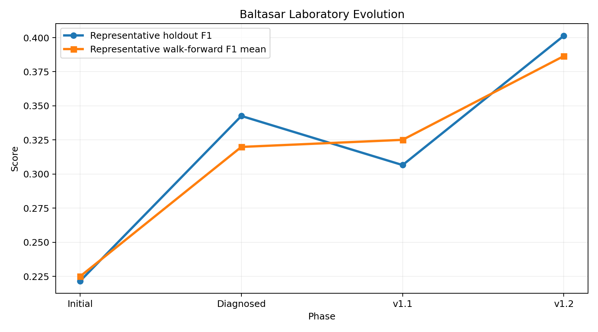
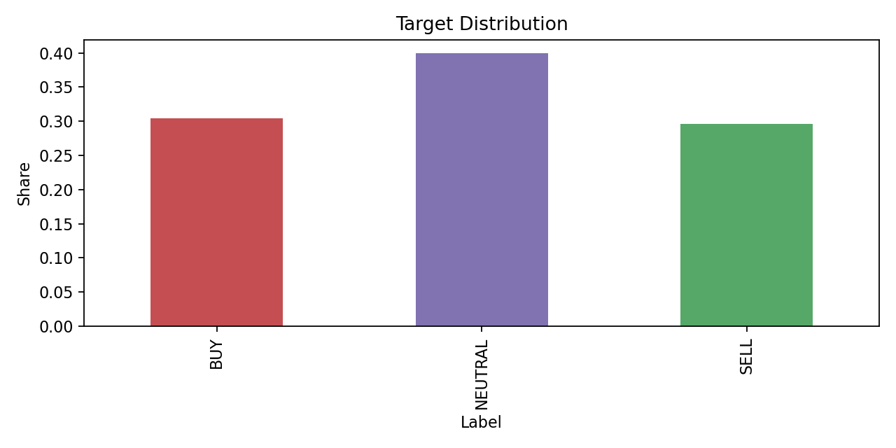
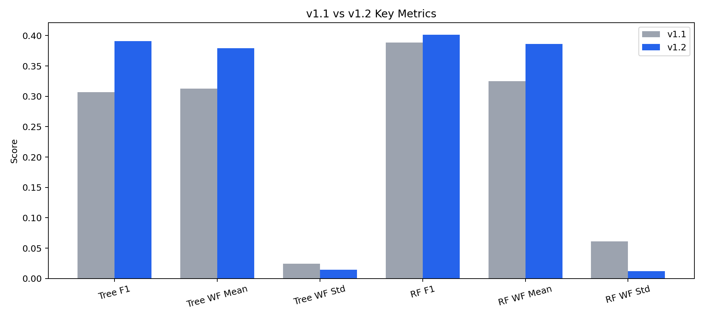
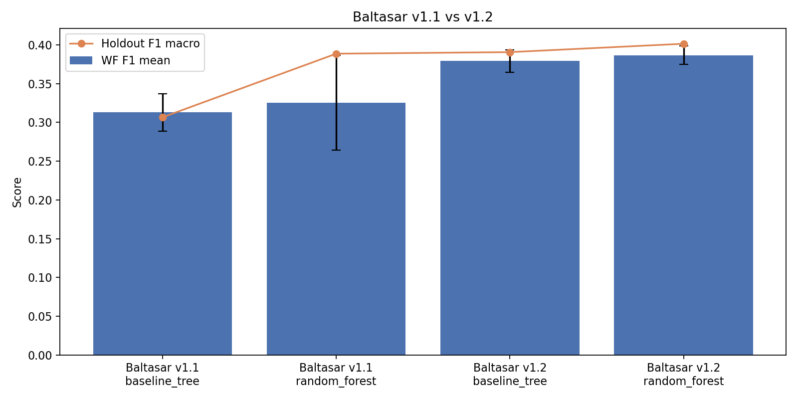
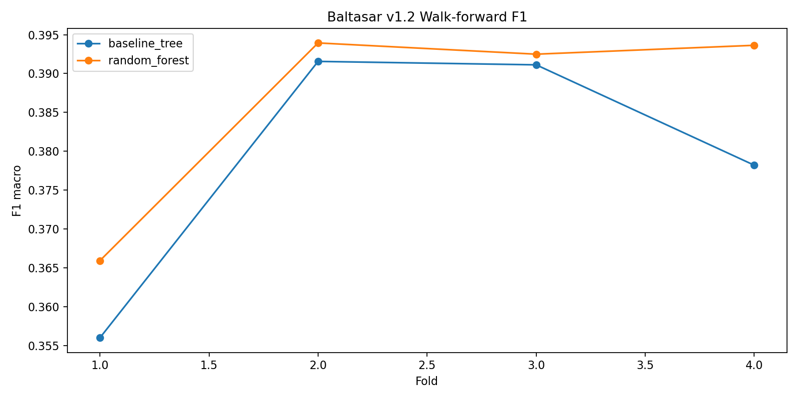
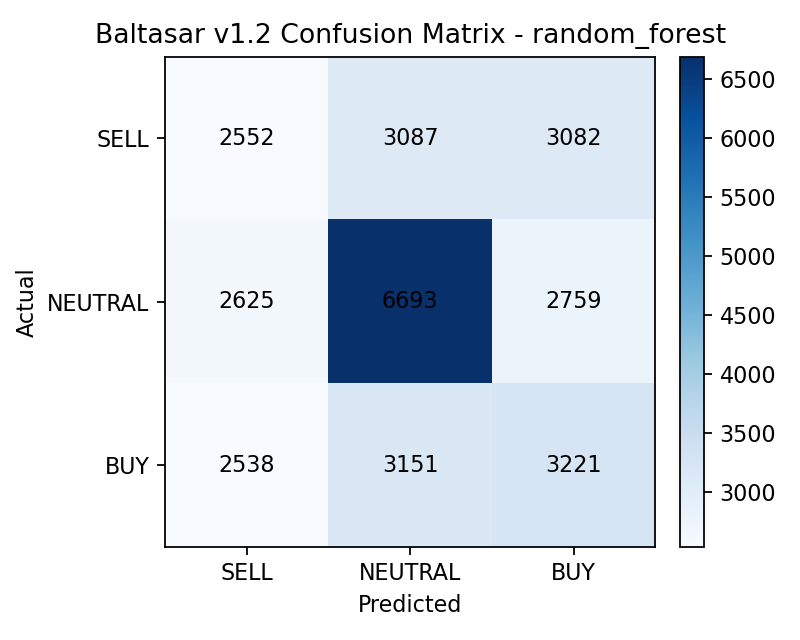
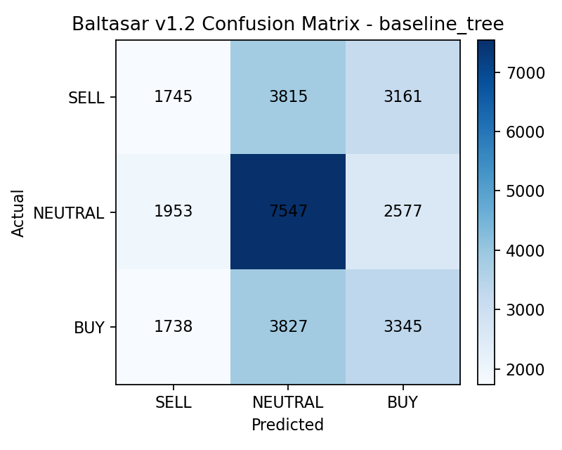

# Baltasar v1.2 Executive Report

## Resumen Ejecutivo

Baltasar v1.2 es la nueva base oficial del laboratorio MAGI para clasificacion de direccion de mercado. La nueva base usa target `h12_t03`, features `compact`, `random_forest` como baseline oficial y `baseline_tree` como referencia explicable.

La decision se tomo despues de revisar el target, simplificar el set de features y validar el sistema sobre un dataset extendido de casi 24 meses. El resultado principal es que Baltasar v1.2 mejora al mismo tiempo senal y estabilidad temporal, que era exactamente el punto debil que impedia promover al bosque aleatorio en v1.1.

## Que Construyo Codex

- Un laboratorio reproducible de entrenamiento, diagnostico y comparacion para Baltasar.
- Un proceso por fases para revisar target, features, estabilidad temporal y benchmark oficial.
- Dashboards, reportes y artefactos que permiten explicar decisiones tecnicas sin depender de memoria oral.
- La consolidacion oficial de Baltasar v1.2 con baseline, referencia explicable y benchmark versionado.

## Problema Inicial de v1.1

Antes de v1.2, el laboratorio ya habia mejorado mucho frente a la primera corrida, pero todavia tenia una tension importante:

- el target original de etapas tempranas estaba demasiado cargado hacia `NEUTRAL`
- la senal cambiaba mucho segun horizonte y threshold
- el `random_forest` mostraba mejor F1 puntual, pero no era lo bastante estable para ser baseline oficial
- el laboratorio necesitaba probar si esa mejora se sostenia fuera del dataset inicial

## Por que se reviso el target

La fase de diagnostico mostro que el target estaba explicando una parte muy grande del problema. Por eso se hizo un barrido sistematico de horizontes y thresholds y luego una validacion cruzada entre `baseline_tree` y `random_forest`.

La conclusion fue que `h12_t03` superaba a `h18_t05` porque:

- reparte mejor las clases
- sostiene mejor la senal al cambiar de modelo
- mantiene una estabilidad temporal razonable
- funciona mejor como base para escalar a una muestra mas larga

## Por que `h12_t03` reemplaza a `h18_t05`

`h18_t05` fue una buena solucion para Baltasar v1.1, pero `h12_t03` mostro mejor consistencia cuando se puso a prueba con dos modelos distintos y despues sobre el dataset extendido.

En terminos ejecutivos:

- `h18_t05` resolvio el problema de desbalance inicial
- `h12_t03` resolvio mejor el problema de generalizacion

## Por que se uso el dataset extendido de 24 meses

La pregunta clave ya no era solo “cual target se ve mejor”, sino “cual configuracion aguanta mejor cuando la muestra crece”.

El dataset extendido usado para v1.2 fue:

- fuente: `run_2024-04-15_00-00-00`
- cobertura: `2024-04-15 00:00:00+00:00` a `2026-04-14 23:50:00+00:00`
- filas brutas: `148551`
- columnas: `35`
- archivos CSV: `520`

Esto permitio medir estabilidad sobre mas regimenes de mercado y reducir el riesgo de sobreinterpretar una ventana corta.

## Distribucion del target oficial

La distribucion del target `h12_t03` sobre el dataset extendido quedo mucho mas sana:

- `NEUTRAL`: 39.96%
- `BUY`: 30.39%
- `SELL`: 29.65%

Lectura ejecutiva: el sistema deja de depender de una clase dominante y eso hace que `F1 macro` tenga mucho mas valor real.

## Comparacion v1.1 vs v1.2

La mejora mas importante no es solo el numero puntual, sino la combinacion entre mejora de F1 y caida de dispersion temporal.

- `baseline_tree` v1.1 -> v1.2
  - `f1_macro`: `0.3066` -> `0.3906`
  - `walk_forward_f1_mean`: `0.3128` -> `0.3792`
  - `walk_forward_f1_std`: `0.0243` -> `0.0144`
- `random_forest` v1.1 -> v1.2
  - `f1_macro`: `0.3886` -> `0.4014`
  - `walk_forward_f1_mean`: `0.3251` -> `0.3865`
  - `walk_forward_f1_std`: `0.0611` -> `0.0119`

## Por que `random_forest` ahora si fue promovido a baseline oficial

En v1.1 el `random_forest` no se promovio porque su ventaja de F1 venia acompañada de una dispersion temporal mucho mayor. En otras palabras: parecia mejor en una foto, pero no en comportamiento entre tramos.

En v1.2 eso cambia:

- `f1_macro`: 0.4014
- `accuracy`: 0.4196
- `walk_forward_f1_mean`: 0.3865
- `walk_forward_f1_std`: 0.0119

La razon de la promocion es simple: el bosque ya no solo gana en senal, tambien gana en estabilidad. Esa era la condicion que faltaba para convertirlo en baseline oficial.

## Papel del `baseline_tree` como referencia explicable

El arbol sigue siendo una pieza importante del laboratorio. No es el baseline oficial, pero si la referencia explicable:

- `f1_macro`: 0.3906
- `accuracy`: 0.4254
- `walk_forward_f1_mean`: 0.3792
- `walk_forward_f1_std`: 0.0144

Su valor ejecutivo es claro:

- facilita explicacion y auditoria
- permite revisar comportamiento por clase con menos complejidad
- sirve como control interpretable si el baseline oficial cambia en futuras fases

Breve lectura: el baseline oficial ya distingue mejor las tres clases y evita el colapso extremo hacia una sola decision.

Breve lectura: el arbol sigue siendo muy util para explicar patrones, aunque el bosque quede ligeramente por delante en desempeno total.

## Metricas por clase

Baseline oficial `random_forest`:

  label  precision   recall       f1  support
   SELL   0.330784 0.292627 0.310538     8721
NEUTRAL   0.517593 0.554194 0.535269    12077
    BUY   0.355440 0.361504 0.358446     8910

Referencia explicable `baseline_tree`:

  label  precision   recall       f1  support
   SELL   0.321008 0.200092 0.246521     8721
NEUTRAL   0.496873 0.624907 0.553583    12077
    BUY   0.368270 0.375421 0.371811     8910

Lectura ejecutiva: en v1.2 ambos modelos son mas equilibrados que en etapas anteriores, y `random_forest` logra el mejor compromiso global entre `SELL`, `NEUTRAL` y `BUY`.

## Riesgos y limitaciones actuales

- El target sigue siendo derivado; no es todavia una etiqueta final de negocio.
- El dataset extendido vive fuera del repo, en la ruta de `Common Files` de MT5, por lo que la reproducibilidad depende de esa ubicacion local.
- Hay 110 gaps mayores a 8 horas; son compatibles con mercado, pero conviene seguir monitoreando segmentacion temporal.
- No hubo tuning ni calibracion; v1.2 formaliza la mejor base actual, no el techo tecnico del sistema.
- Las variables ligadas a posicion siguen teniendo missing alto y hoy no son el centro de la senal.

## Que puede hacer Baltasar hoy

- Servir como baseline serio y gobernable para clasificacion de direccion de mercado.
- Comparar futuras mejoras sobre una base ya establecida y defendible.
- Entregar senal mejor balanceada y mas estable que en v1.1.

## Que no puede hacer todavia

- No esta listo para despliegue operativo final sin una fase posterior de calibracion y gobierno.
- No sustituye por si solo la logica de negocio completa de Prosperity.
- No incorpora aun costos de error, calibracion probabilistica ni reglas de accion reales.

## Decision sugerida para Prosperity

1. Adoptar Baltasar v1.2 como nueva base oficial del laboratorio.
2. Usar `random_forest` como baseline tecnico de referencia para comparaciones futuras.
3. Mantener `baseline_tree` como modelo explicable para auditoria, demos y analisis de comportamiento.
4. Autorizar una siguiente fase enfocada en calibracion, robustez operacional y criterios de promocion hacia uso mas exigente.

## Proximos pasos recomendados

- consolidar monitoreo recurrente de estabilidad temporal
- revisar calibracion y costos por clase
- definir una etiqueta de negocio mas cercana al resultado operativo real
- establecer reglas formales para futuras promociones de baseline
