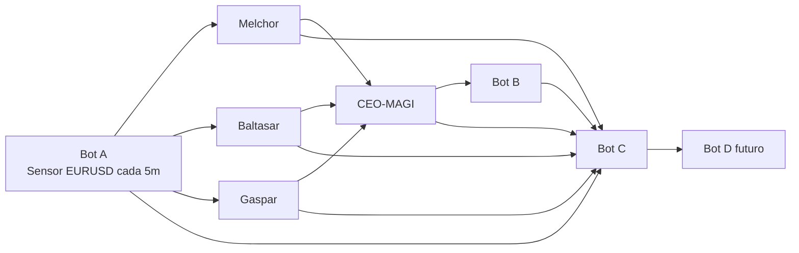

# 02. Architecture Overview

## Componentes principales

- `Bot A`: sensor periodico de mercado.
- `Melchor`: riesgo y seguridad.
- `Baltasar`: validacion tecnica.
- `Gaspar`: oportunidad y exploracion.
- `CEO-MAGI`: arbitraje final.
- `Bot B`: ejecucion.
- `Bot C`: auditoria y dataset.
- `Bot D`: optimizacion futura.

## Vista estructural

## Restricciones del MVP

- Solo `EURUSD`.
- Maximo una operacion abierta.
- Maximo un caso activo.
- Sin ML real en produccion.
- Sin trailing avanzado.

## Idea clave

La arquitectura separa con claridad observacion, evaluacion, arbitraje, ejecucion y aprendizaje futuro. Esa separacion es la principal defensa contra el caos operacional y contra una futura integracion opaca de ML.
