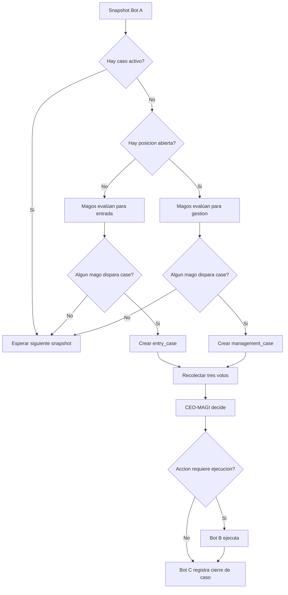

# 03. System Flow

## Flujo principal

1. `Bot A` toma un snapshot de `EURUSD` cada 5 minutos.
2. El snapshot se distribuye a los tres magos.
3. Cada mago analiza el mismo contexto.
4. Si ningun mago detecta necesidad real de accion, no nace caso.
5. Si uno o varios magos detectan oportunidad o necesidad de gestion, se activa un caso MAGI.
6. Los tres magos emiten voto formal sobre ese caso.
7. `CEO-MAGI` resuelve el caso.
8. `Bot B` ejecuta si la accion lo requiere.
9. `Bot C` registra el caso completo y su outcome posterior.

## Tipos de caso

- `entry_case`: solo cuando no hay posicion abierta.
- `management_case`: solo cuando existe una posicion abierta.

## Reglas de unicidad

- Si hay un caso activo, no nace otro.
- Si hay una posicion abierta, no se permiten nuevos `entry_case`.
- Con posicion abierta, solo pueden activarse `management_case`.

## Diagrama de flujo

